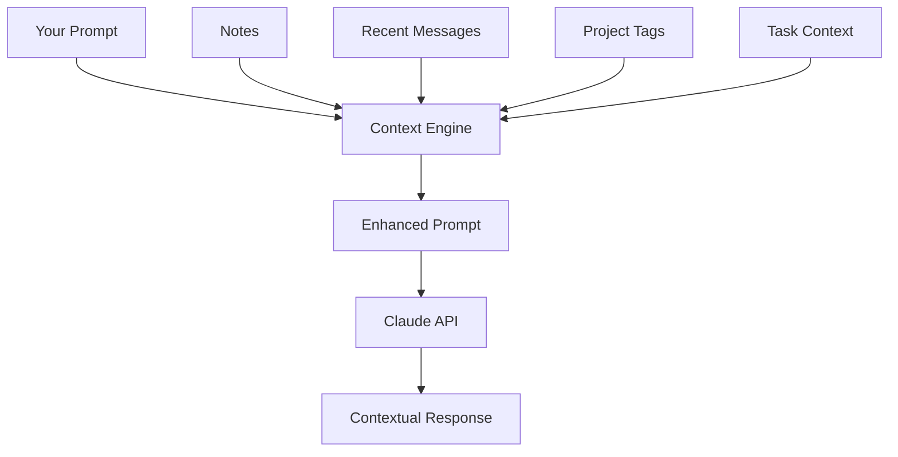

# Context Awareness

Mythril learns from your team's conversations and notes, providing increasingly relevant assistance over time. This context awareness makes AI responses more accurate and useful.

## How Context Works

When you use `/forge`, Mythril enhances your prompt with relevant context:



## Context Sources

### Notes

Notes you save are searchable context:

```
/note add We use TypeScript strict mode across all projects
```

Later, when you ask:
```
/forge Write a utility function for date formatting
```

Mythril includes the TypeScript preference, generating TypeScript code with strict types.

### Project Tags

Tag notes with projects for specific context:

```
/note add project:api We follow REST conventions with JSON:API responses
/note add project:api Authentication uses Bearer tokens
```

When working on the API project:
```
/forge project:api Create an endpoint for user registration
```

The response follows your REST conventions and includes Bearer token auth.

### Conversation History

Recent messages in the channel provide context:

**You**: "We're refactoring the auth module"

**Later in the same channel**:
```
/forge What's the best way to handle session tokens?
```

Mythril understands you're asking in the context of the auth refactor.

### Active Tasks

Your current tasks add context:

If you're assigned to "Implement OAuth2 login":
```
/forge How should I structure the callback handler?
```

Mythril knows you're asking about OAuth2 callbacks.

## Building Effective Context

### Capture Decisions

Save architectural decisions when made:

```
/note add tags:decision,database Chose PostgreSQL over MongoDB for ACID compliance
/note add tags:decision,frontend Using React 18 with TypeScript
/note add tags:decision,api GraphQL for public API, REST for internal services
```

### Document Patterns

Record coding patterns your team uses:

```
/note add tags:pattern,error Error handling: use Result<T, Error> pattern
/note add tags:pattern,naming Components: PascalCase, utilities: camelCase
```

### Note Dependencies

Track important dependencies:

```
/note add tags:deps,auth Using passport.js v0.6 for authentication
/note add tags:deps,orm Prisma 5.0 with PostgreSQL adapter
```

### Record Constraints

Document technical constraints:

```
/note add tags:constraint Node.js 18+ required for native fetch
/note add tags:constraint Must support IE11 for legacy portal
```

## Context in Action

### Example: Database Query

Without context:
```
/forge Write a query to get active users
```

Generic response:
```sql
SELECT * FROM users WHERE status = 'active';
```

With context (notes mention PostgreSQL, Prisma):
```
/forge Write a query to get active users
```

Contextual response:
```typescript
const activeUsers = await prisma.user.findMany({
  where: { status: 'active' },
  orderBy: { createdAt: 'desc' },
});
```

### Example: API Endpoint

Without context:
```
/forge Create a login endpoint
```

Generic REST endpoint.

With context (notes mention your API conventions):
```
/forge Create a login endpoint
```

Endpoint following your JSON:API format, Bearer token auth, and error handling patterns.

## Managing Context

### Viewing Active Context

See what context Mythril is using:

```
/mythril context view
```

Shows:
- Relevant notes being used
- Current project context
- Recent conversation topics

### Clearing Context

Reset conversation context:

```
/mythril context clear
```

Useful when:
- Starting a new topic
- Context is outdated
- Getting unexpected results

### Excluding Context

Temporarily disable context:

```
/forge --no-context Write a basic hello world function
```

### Context Scope

Control context scope:

```
/settings context scope server
```

Options:
- `channel` - Only same channel context
- `server` - All server context (default)
- `project` - Only tagged project context

## Privacy Considerations

### What's Included

Context sent to Claude includes:
- Your current prompt
- Relevant notes (searched by keyword)
- Recent channel messages (last 10)
- Active task descriptions

### What's Excluded

Never included in context:
- Messages from other servers
- DMs
- Notes marked as private
- Messages older than 24 hours

### Data Handling

- Context is processed per-request
- Not stored beyond the conversation
- Subject to Anthropic's data policies

### Controlling Privacy

Exclude sensitive notes:

```
/note add private:true API credentials in vault at /secrets/api
```

## Best Practices

### Keep Notes Updated

Remove outdated notes:
```
/note delete id:NOTE-OLD
```

Or update them:
```
/note add tags:deps Updated to Prisma 5.x
```

### Use Specific Tags

Generic tags are less useful:
```
/note add tags:code Some code pattern  # Bad
/note add tags:pattern,validation,frontend Form validation pattern  # Good
```

### Review Context Periodically

Check what context exists:
```
/note list limit:50
```

Clean up irrelevant notes.

### Project Isolation

Use project tags when working on multiple projects:
```
/note add project:app-a Uses Express.js
/note add project:app-b Uses Fastify
```

Then specify the project:
```
/forge project:app-a Add middleware for logging
```

## Troubleshooting

### Wrong Context Being Used

1. Check recent notes with `/note list`
2. Use `/mythril context view` to see active context
3. Clear with `/mythril context clear`
4. Be more specific in your prompt

### Context Not Applied

1. Verify notes exist with `/note search`
2. Check project tags match
3. Ensure context feature is enabled:
   ```
   /settings feature context enabled
   ```

### Too Much Context

If responses seem confused:
1. Clear context: `/mythril context clear`
2. Reduce note verbosity
3. Use project tags to scope context
4. Use `--no-context` flag temporarily
