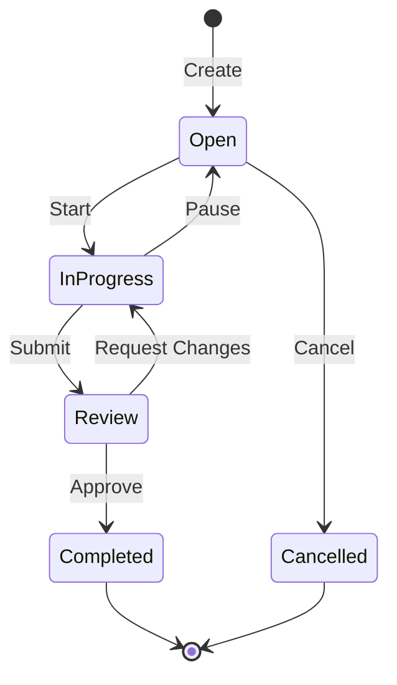

# Task Management

Mythril provides streamlined task management designed for development teams. Create, track, and organize work without leaving Discord.

## Overview

Task management in Mythril is designed to be:

- **Fast** - Create tasks in seconds with slash commands
- **Visible** - Track progress directly in your Discord channels
- **Integrated** - Connect tasks with notes and AI assistance
- **Lightweight** - Just enough structure without overhead

## Task Lifecycle



## Creating Tasks

### Quick Task

The simplest way to create a task:

```
/task create title:Fix login button
```

### Detailed Task

Add more context when needed:

```
/task create title:Implement OAuth login description:Add Google and GitHub OAuth providers priority:high assignee:@Alice due:2024-12-31 tags:auth,feature
```

### Task Properties

| Property | Required | Description |
|----------|----------|-------------|
| `title` | Yes | Brief description (max 100 chars) |
| `description` | No | Detailed information |
| `priority` | No | `low`, `medium`, `high`, `critical` |
| `assignee` | No | User to assign |
| `due` | No | Due date (YYYY-MM-DD) |
| `tags` | No | Comma-separated labels |

## Task Organization

### Priorities

Use priorities to surface important work:

| Priority | When to Use |
|----------|-------------|
| `low` | Nice to have, no deadline |
| `medium` | Should be done soon (default) |
| `high` | Important, has deadline |
| `critical` | Blocking issue, immediate attention |

### Tags

Organize tasks with meaningful tags:

```
/task create title:Update API docs tags:docs,api
/task create title:Fix memory leak tags:bug,performance
/task create title:Add dark mode tags:feature,ui
```

Common tag categories:
- **Type**: `bug`, `feature`, `chore`, `docs`
- **Area**: `frontend`, `backend`, `api`, `database`
- **Priority**: `urgent`, `quick-win`, `tech-debt`

### Filtering

Find tasks quickly with filters:

```
/task list status:open
/task list priority:high
/task list assignee:me
/task list tags:bug
/task list status:open priority:high assignee:me
```

## Workflows

### Solo Developer

Simple workflow for individual developers:

1. **Create**: `/task create title:Implement feature X`
2. **Start**: `/task update id:TASK-1 status:in_progress`
3. **Complete**: `/task complete id:TASK-1`

### Team Workflow

Collaborative workflow for teams:

1. **Backlog**: Create tasks as ideas arise
2. **Sprint**: Filter and assign tasks
3. **Work**: Update status as work progresses
4. **Review**: Move to review when ready
5. **Complete**: Mark done after approval

### Agile/Scrum

Map Mythril to your agile process:

| Scrum Concept | Mythril Feature |
|---------------|-----------------|
| Product Backlog | All open tasks |
| Sprint Backlog | Filtered by tags/assignee |
| In Progress | `status:in_progress` |
| Done | `status:completed` |
| Sprint Review | `/task list status:completed` |

## Notifications

Stay informed about task updates:

### Enable Notifications

```
/settings feature notifications enabled
```

### Notification Types

| Event | Notification |
|-------|--------------|
| Assigned to you | DM + Channel mention |
| Status changed | Channel update |
| Due date approaching | DM reminder |
| Task overdue | DM alert |

### Notification Channel

Set a dedicated channel for task updates:

```
/settings channel tasks #dev-tasks
```

## Integration with AI

### AI-Assisted Task Creation

Use `/forge` to help define tasks:

```
/forge Based on this bug report, create task details:
"Users can't log in on mobile Safari"
```

### Context from Tasks

Active tasks provide context for `/forge`:

```
/forge How should I approach the implementation?
```

Mythril includes your current task context in the AI request.

### Task Summaries

Get AI-generated summaries:

```
/forge Summarize the work done this sprint based on completed tasks
```

## Best Practices

### Keep Tasks Small

Break large work into smaller tasks:

**Too Big**:
```
/task create title:Build user authentication system
```

**Better**:
```
/task create title:Create login form UI
/task create title:Implement JWT token generation
/task create title:Add password reset flow
```

### Use Descriptions

Add context that helps future you:

```
/task create title:Fix Safari login bug description:Users report login fails silently on iOS Safari 16+. Check for SameSite cookie issues.
```

### Update Status Regularly

Keep status current for team visibility:

```
/task update id:TASK-123 status:in_progress
```

### Link Related Tasks

Reference related tasks in descriptions:

```
/task create title:Add logout endpoint description:Related to TASK-100 (login endpoint)
```

### Clean Up Regularly

Archive or delete stale tasks:

```
/task list status:open
/task delete id:TASK-OLD
```

## Exporting Tasks

Export tasks for external tools:

```
/task export format:csv
/task export format:json
```

Use exports for:
- Sprint retrospectives
- Project reporting
- Migration to other tools
- Backup purposes

## Limitations

### Task Count

Free tier: 10 active tasks per server
Pro tier: Unlimited tasks

### Description Length

Maximum 2000 characters per description.

### Tags

Maximum 10 tags per task.

### History

Task history retained for 90 days.

## Troubleshooting

### Tasks Not Appearing

1. Check filter settings
2. Verify you have permission to view
3. Refresh with `/task list`

### Can't Assign Users

1. User must be in the server
2. Check role permissions
3. Verify Mythril permissions

### Notifications Not Working

1. Check DM settings allow bot messages
2. Verify feature is enabled
3. Check notification channel permissions
